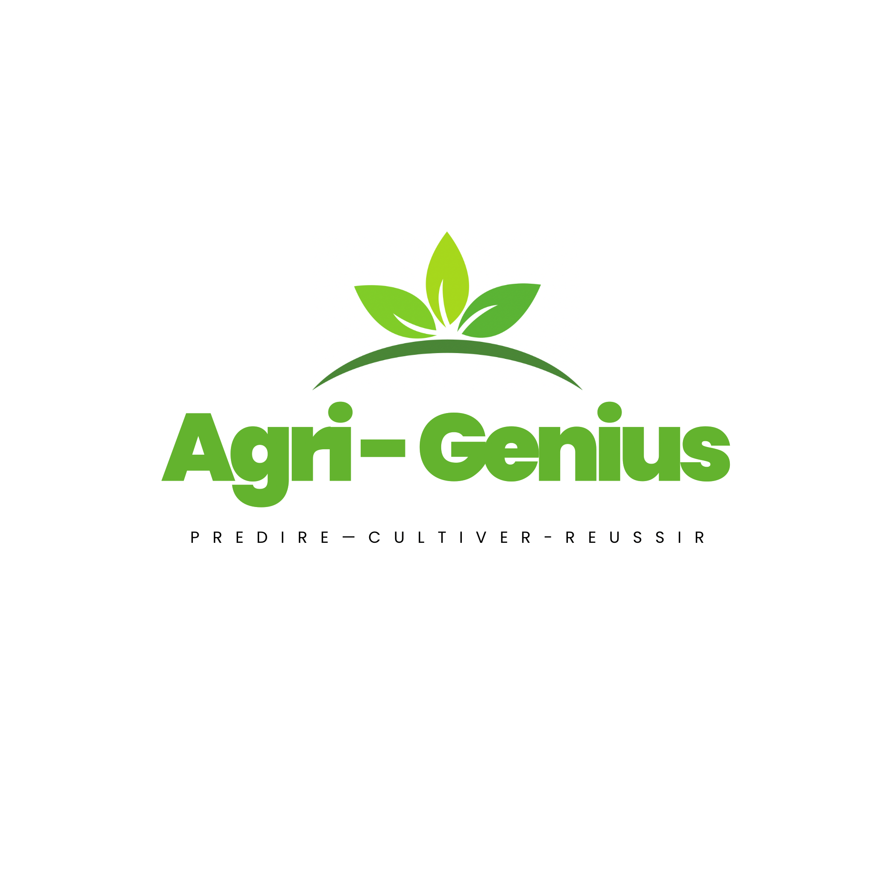

# 🌾 AgriGenius - Plateforme Intelligente de Digitalisation Agricole



> Plateforme web complète pour la digitalisation de l'agriculture au Cameroun avec Intelligence Artificielle, formation en ligne et marketplace agricole.

## 📋 Vue d'ensemble

**AgriGenius** est une plateforme innovante qui accompagne les producteurs camerounais du diagnostic agronomique à la commercialisation grâce à l'intelligence artificielle.

### 🎯 Objectifs

- **Démocratiser** l'accès à l'expertise agronomique via l'IA
- **Former** les agriculteurs aux meilleures pratiques
- **Faciliter** la commercialisation des produits agricoles
- **Connecter** tous les acteurs de la chaîne de valeur

## ✨ Fonctionnalités

### 🤖 Modules d'Intelligence Artificielle

#### 1. Diagnostic Phytosanitaire
- Détection automatique des maladies des plantes
- Analyse d'images par IA
- Recommandations de traitement personnalisées
- Cultures supportées : Cacao, Café, Manioc, Maïs, etc.

#### 2. Diagnostic Pédologique
- Analyse des types de sol
- Recommandations de cultures adaptées
- Conseils d'amendement du sol
- Estimation du pH

### 📚 Module de Formation

- **Cours structurés** par filière et niveau
- **Modules interactifs** avec vidéos
- **Suivi de progression** personnalisé
- **Certificats** à la fin des cours
- **Quiz d'évaluation** (à venir)

### 🛒 Marketplace Agricole

- **Vente directe** producteur-acheteur
- **Gestion d'annonces** avec photos
- **Système de commandes** intégré
- **Géolocalisation** des produits
- **Modération** par les administrateurs

### 👤 Gestion des Utilisateurs

- **4 rôles** : Agriculteur, Acheteur, Expert, Admin
- **Authentification sécurisée** JWT + Bcrypt
- **Reset de mot de passe** par email
- **Profils personnalisables** avec photo
- **Notifications** en temps réel

### 🔧 Administration

- **Gestion des utilisateurs** (activation/désactivation)
- **Gestion des cours** et modules
- **Modération du marketplace**
- **Tableau de bord** avec statistiques
- **Contrôle complet** de la plateforme

### 📱 Progressive Web App (PWA)

- **Installable** sur mobile, tablette et desktop
- **Icônes** adaptatives (11 tailles)
- **Raccourcis rapides** vers les modules clés
- **Mode plein écran**
- **Web Share API** pour partager des images
- **Optimisé** pour tous les appareils

## 🏗️ Architecture

### Backend (FastAPI)

```
backend/
├── app/
│   ├── api/
│   │   ├── routes/          # Endpoints API
│   │   │   ├── auth.py
│   │   │   ├── users.py
│   │   │   ├── diagnostics.py
│   │   │   ├── formation.py
│   │   │   ├── marketplace.py
│   │   │   ├── notifications.py
│   │   │   ├── admin.py
│   │   │   └── dashboard.py
│   │   └── deps.py          # Dépendances (auth, db)
│   ├── models/              # Modèles SQLAlchemy (11 tables)
│   ├── schemas/             # Schémas Pydantic
│   ├── core/
│   │   ├── config.py
│   │   ├── database.py
│   │   └── security.py
│   └── utils/
├── main.py                  # Point d'entrée FastAPI
└── requirements.txt
```

### Frontend (Next.js 16.2.6)

```
frontend/
├── app/
│   ├── auth/                # Pages d'authentification
│   ├── dashboard/           # Tableau de bord
│   │   ├── admin/          # Panel admin
│   │   ├── diagnostic/     # Modules IA
│   │   ├── formation/      # Cours
│   │   ├── marketplace/    # Annonces
│   │   └── settings/       # Paramètres
│   ├── layout.tsx
│   └── page.tsx            # Page d'accueil
├── components/
│   ├── dashboard/          # Composants du dashboard
│   ├── layout/             # Navbar, Footer
│   └── sections/           # Sections homepage
├── context/
│   └── AuthContext.tsx     # Gestion auth globale
├── public/
│   ├── icons/              # Icônes PWA
│   └── manifest.json       # Configuration PWA
└── package.json
```

## 🛠️ Technologies

### Backend
- **FastAPI** - Framework web moderne et rapide
- **SQLAlchemy** - ORM Python
- **MySQL** - Base de données relationnelle
- **Pydantic** - Validation des données
- **JWT** - Authentification sécurisée
- **Bcrypt** - Hachage des mots de passe
- **Python 3.13**

### Frontend
- **Next.js 16.2.6** - Framework React avec App Router
- **TypeScript 5** - Typage statique
- **Tailwind CSS 4** - Framework CSS utility-first
- **GSAP 3.15.0** - Animations fluides
- **React Context API** - Gestion d'état globale
- **PWA** - Progressive Web App

## 🚀 Installation

### Prérequis

- Python 3.13+
- Node.js 18+
- MySQL 8.0+
- WAMP/XAMPP (Windows) ou MySQL Server

### 1. Cloner le repository

```bash
git clone https://github.com/groupeoctal/agrigenius.git
cd agrigenius
```

### 2. Configuration Backend

```bash
cd backend

# Créer un environnement virtuel
python -m venv venv
source venv/bin/activate  # Linux/Mac
venv\Scripts\activate     # Windows

# Installer les dépendances
pip install -r requirements.txt

# Configurer les variables d'environnement
cp .env.example .env
# Éditer .env avec vos paramètres MySQL et SECRET_KEY
```

**Créer la base de données :**

```sql
CREATE DATABASE agrigenius_db CHARACTER SET utf8mb4 COLLATE utf8mb4_unicode_ci;
```

**Lancer le backend :**

```bash
python -m uvicorn main:app --reload --port 9000 --host 127.0.0.1
```

Le backend sera accessible sur : http://127.0.0.1:9000

Documentation API : http://127.0.0.1:9000/docs

### 3. Configuration Frontend

```bash
cd frontend

# Installer les dépendances
npm install

# Configurer l'URL de l'API
cp .env.local.example .env.local
# Éditer .env.local
# NEXT_PUBLIC_API_URL=http://127.0.0.1:9000/api

# Générer les icônes PWA (optionnel)
python generate_icons.py

# Lancer le serveur de développement
npm run dev
```

Le frontend sera accessible sur : http://localhost:3000

### 4. Base de données

Les tables seront créées automatiquement au premier lancement du backend grâce à SQLAlchemy.

**Tables créées (11) :**
- users
- password_resets
- diagnostics
- cours
- modules_cours
- progressions
- quiz_questions
- quiz_resultats
- annonces
- commandes
- notifications

## 📖 Documentation

La documentation technique complète est disponible dans :
- **[RAPPORT_AGRIGENIUS.md](./RAPPORT_AGRIGENIUS.md)** - Rapport technique détaillé (1886 lignes)
- **[frontend/PWA_README.md](./frontend/PWA_README.md)** - Documentation PWA

### Sections du rapport

1. Présentation du projet
2. Architecture et conception
3. Technologies utilisées
4. Schéma de base de données (11 tables détaillées)
5. **Modules IA - Fonctionnement détaillé** (étape par étape)
6. Modules fonctionnels
7. Gestion des utilisateurs et rôles (RBAC)
8. Module d'administration
9. API REST (50+ endpoints)
10. Interface utilisateur
11. Progressive Web App (PWA)
12. Sécurité
13. Difficultés rencontrées et solutions
14. Améliorations futures

## 👥 Rôles et Permissions

| Rôle | Accès |
|------|-------|
| **Agriculteur** | Diagnostics IA, Formation, Marketplace (vendre) |
| **Acheteur** | Formation, Marketplace (acheter) |
| **Expert** | Tous les modules (consultation) |
| **Admin** | Accès complet + administration |

## 🔐 Sécurité

- **Authentification JWT** (HS256, expiration 24h)
- **Hachage Bcrypt** (12 salt rounds)
- **Validation Pydantic** côté backend
- **Protection CSRF** via tokens
- **Upload sécurisé** (validation type + taille)
- **CORS configuré**
- **RBAC** (Role-Based Access Control)

## 📊 Statistiques du Projet

- **15,000+ lignes de code** (Backend + Frontend)
- **50+ endpoints API**
- **11 tables** de base de données
- **2 modules IA** (Phytosanitaire, Pédologique)
- **4 rôles utilisateur**
- **64+ fichiers frontend**
- **11 icônes PWA**

## 🌍 Impact Attendu

- 🌾 **Productivité** : +20-30% grâce aux diagnostics précoces
- 📚 **Formation** : 10,000+ agriculteurs formés (2 ans)
- 💰 **Réduction des pertes** : -15% grâce aux traitements ciblés
- 🤝 **Connexion** : Élimination des intermédiaires

## 🔮 Roadmap

### Court terme
- [ ] Implémenter les quiz interactifs
- [ ] Ajouter le système de paiement Mobile Money
- [ ] Intégrer une API météo

### Moyen terme
- [ ] Deep Learning réel pour les diagnostics
- [ ] Notifications push (PWA)
- [ ] Application mobile native (React Native)

### Long terme
- [ ] Chatbot IA conversationnel
- [ ] Intégration de capteurs IoT
- [ ] Analyse prédictive des rendements
- [ ] Données satellitaires

## 🤝 Contribution

Les contributions sont les bienvenues ! Pour contribuer :

1. Fork le projet
2. Créer une branche (`git checkout -b feature/AmazingFeature`)
3. Commit les changements (`git commit -m 'Add AmazingFeature'`)
4. Push vers la branche (`git push origin feature/AmazingFeature`)
5. Ouvrir une Pull Request

## 📝 Licence

Ce projet est sous licence MIT - voir le fichier [LICENSE](LICENSE) pour plus de détails.

## 👨‍💻 Équipe

**Groupe Octal** - Développement et conception

## 📧 Contact

Pour toute question ou suggestion :
- Email : contact@groupeoctal.com
- GitHub : [@groupeoctal](https://github.com/groupeoctal)

---

**Développé avec ❤️ pour l'agriculture camerounaise**

Version 1.0 - Juin 2026
